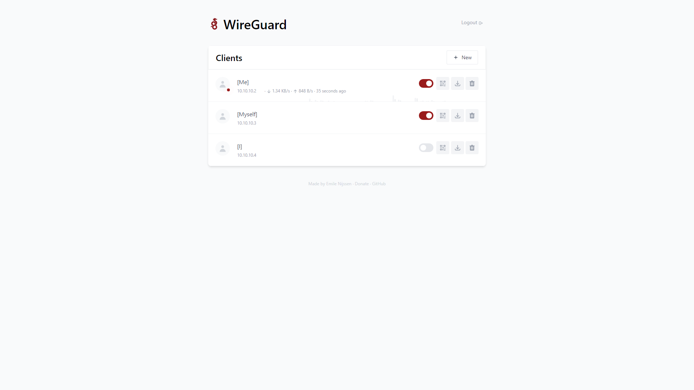
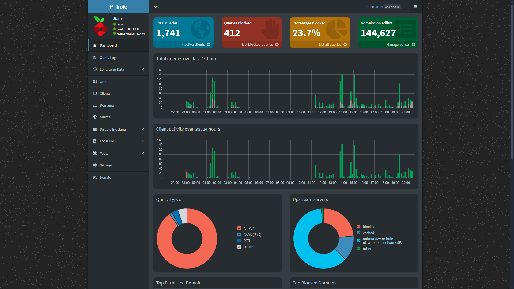

# Wire-hole

*Idea of dockerization inspired by [@IAmStoxe](https://github.com/IAmStoxe). Origin repository [IAmStoxe/wirehole](https://github.com/IAmStoxe/wirehole).*

---

Wire-hole comprises images of Unbound, Pi-hole, and Wireguard in a docker-compose configuration file. It aims to enhance your daily internet usage by providing a more secure and less intrusive experience, achievable through a minimal number of straightforward steps. The web-interfaces of Pi-hole and Wireguard contribute to facilitating this improvement. You can manage VPN clients, DNS-records, block ads, monitor logs and many more feature present in this project.

*__`NOTICE!`__ This configuration will not work on Windows host machine, clients doesn't matter.* 

## Preview of web interfaces





## Quick start

Before start you must make sure, that [Docker Engine](https://docs.docker.com/engine/install/), [Docker Compose](https://docs.docker.com/compose/install/) and [git](https://git-scm.com/) installed on your host machine.

1. Clone the WireHole repository from GitHub
   ```bash
   #!/bin/bash
   git clone https://github.com/kunitskyi/Wire-hole.git
   ```
1. Change directory to the cloned repository
   ```bash
   #!/bin/bash
   cd Wire-hole
   ```
1. Rename or copy __*.env.example*__ to __*.env*__ 
   ```bash
   #!/bin/bash
   cp .env.example .env
   ```
1. Edit __*.env*__ file, by changing value of:
   - __`PublicIP`__ must contain public IPv4 of your server.
   - __`PiHolePassword`__ and __`WireguardPassword`__ to more secure password.
   - __`TimeZone`__ set your timezone to make sure logs in Pi-hole rotate at local midnight instead of at "Europe/Kyiv" midnight.

    in any text editor, for example you can use nano
    ```bash
    #!/bin/bash
    nano .env
    ```
1. Start your composition:
   ```bash
   #!/bin/bash
   docker compose up -d
   ```
1. Now, you ready to add wireguard clients, just log in on [http:/192.0.2.27:51810](http:/192.0.2.27:51810), using password which your change in __*.env*__ file. Change __*`192.0.2.27`*__ in url to __your__ Public IP.

## Tips&Recommendation

- By *default* your Wireguard accessible from internet to __anyone__!
  - To fix this you must after creating first clients, comment line `"51810:51821/tcp"` in __*docker-compose.yml*__, like below:
    ```yaml
    ports:
      - "51820:51820/udp"
      # - "51810:51821/tcp" # Web-interface
    ```
  - Then restart your composition
    ```bash
    #!/bin/bash
    docker compose restart
    ```
  - Now you will be able connect to your Wireguard web-interface only when you enable VPN connection on client by *default* address: [http:/10.100.100.10:51821](http:/10.100.100.10:51821)
- You can access *Pi-hole* web-interface only when you enable VPN connection on client by *default* address: [http:/10.100.100.10:80](http:/10.100.100.10:80)
- In `.env` file:
  - Make sure __`PublicIP`__ contain public IP of your server.
  - Change value of strings __`PiHolePassword`__ and __`WireguardPassword`__ to more secure password.
- You can check if you did everything right by visiting [DNS leak](https://www.dnsleaktest.com/). On main page you must see your server public IPv4 and after either Standard or Extended test  in results also must be same IP address.
- Folder __*cache*__ contain data with Wireguard settings, Pi-hole configurations, logs, etc.
- You can always customize it setup for yourself very easy, if you now how to do it and why to do it.

## Environment file configuration

| Variable | Example Value | Description |
| :---: | :---: | --- |
| PublicIP | `192.0.2.27` |  Public IP of your server |
| PiHolePassword | `VeryStrongPASS` | Password from Pi-hole web-interface |
| WireguardPassword | `VeryStrongPASS` | Password from Wireguard web-interface |
| TimeZone | `"Europe/Kyiv"` | Pi-hole timezone setting for logs rotate at local midnight instead of at UTC midnight.|
| UnboundIP | `10.100.100.20` | Static IP address assigned to __*Unbound*__
| WireguardIP | `10.100.100.10` |  Static IP address assigned to __*Wireguard / Pi-hole*__

__*Don't touch `UnboundIP` and `WireguardIP` assigned address, unless you know what you are doing.__

More information about variables you can find on Dockerhub or GitHub page of specific image. How to configure them, you can find [here](https://docs.docker.com/compose/environment-variables/).

<!-- ## Scheme

*Image below contain visualisation of default configuration* -->

## About images

 `klutchell/unbound` - unofficial unbound docker image, which serves as a validating, recursive, caching DNS resolver. It is designed to be fast and lean and incorporates modern features based on open standards.

  [Dockerhub](https://hub.docker.com/r/klutchell/unbound) | [Documentation](https://unbound.docs.nlnetlabs.nl/en/latest/)

 `pihole/pihole` - DNS sinkhole that protects your devices from unwanted content without installing any client-side software. 
 
 [Dockerhub](https://hub.docker.com/r/pihole/pihole) | [GitHub](https://github.com/pi-hole/docker-pi-hole/tree/master) | [Documentation](https://docs.pi-hole.net/)

 `weejewel/wg-easy` - unofficial wireguard docker image, which serves as a VPN server, with easy to use web-interface. 
 
 [Dockerhub](https://hub.docker.com/r/weejewel/wg-easy) | [Unofficial Documentation](https://github.com/pirate/wireguard-docs)

